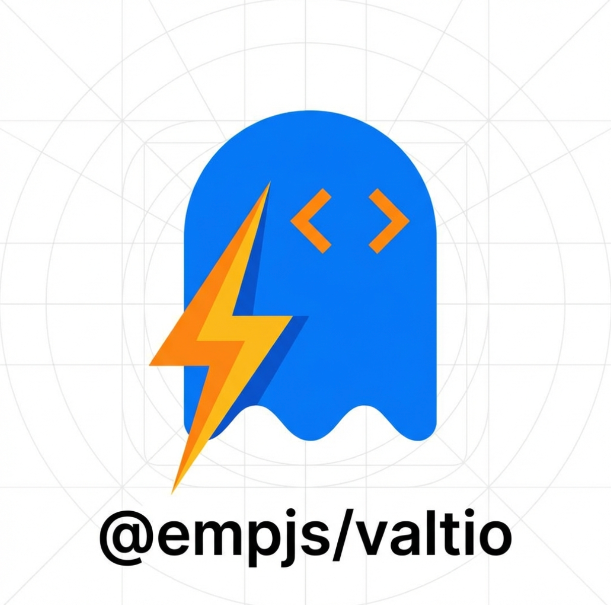

<div align="center">



# valtio-best-practices

[](https://www.npmjs.com/package/@empjs/valtio)
[](https://opensource.org/licenses/MIT)
[](https://github.com/empjs/valtio-best-practices)

基于 [Valtio](https://github.com/pmndrs/valtio) 的增强状态库与最佳实践：在保留 Valtio 细粒度响应式与快照语义的前提下，提供更少的样板代码和开箱即用的高级能力（历史、派生、持久化、嵌套更新等）。

</div>

---

## 仓库结构

| 路径 | 说明 |
|------|------|
| **`packages/valtio`** | 核心包 `@empjs/valtio`，增强的 createStore / useStore、createMap / createSet 及配套方法 |
| **`apps/valtio-offical`** | 文档站应用，包含安装说明、API 说明与可运行示例（createStore、useStore、collections、subscribe、performance 等） |
| **`docs/`** | 设计说明与对比文档（如 `improvements.md`、`compare.md`） |

## 快速开始

```bash
# 安装依赖
pnpm install

# 构建核心包
pnpm --filter @empjs/valtio build

# 启动文档站
pnpm dev
```

在项目中使用增强库：

```bash
pnpm add @empjs/valtio
```

使用方式见 **[packages/valtio/README.md](./packages/valtio/README.md)**（安装、快速上手、API 概览与文档链接）。

## 脚本说明

| 命令 | 说明 |
|------|------|
| `pnpm dev` | 启动文档站开发服务器 |
| `pnpm lint` | 运行 Biome 检查并自动修复 |
| `pnpm --filter @empjs/valtio build` | 构建 `@empjs/valtio` |
| `pnpm --filter @empjs/valtio test` | 运行 valtio 包测试 |
| `pnpm typecheck` | 使用 TypeScript 7 检查包和页面类型（需先构建核心包） |
| `pnpm test:e2e` | 构建后用 Rstest + Playwright 验收 EMP 生产预览页面 |
| `pnpm verify` | 单元测试、构建、类型检查、E2E 和打包检查 |

## main 自动部署与发版

工作流：`.github/workflows/release.yml`。PR 执行测试、构建、TS 7 类型检查和 Rstest E2E；提交到 `main` 后，全部检查通过才会部署 Cloudflare Pages 并按需发布 npm 包。也可在 Actions 手动重跑（仅 main 可以部署或发布）。

- 页面：先按源码基线构建核心包用于内容比较，再确定版本并重新构建包和文档站；npm 版本回读通过后，上传同一批验收产物至 Cloudflare Pages 项目 `valtio-best-practices` 的 `main` 生产分支。
- npm：对实际打包文件计算指纹。内容与 npm 最新版一致时跳过；变化时从 npm 最新版自动递增 patch。首次启用会发布一个包含指纹的新版本。仅修改页面或测试不会触发新包，除非同时改变了包产物。
- 主动升级 minor/major：把 `packages/valtio/package.json` 的版本设为高于 npm 最新版的稳定版本。自动版本写入 CI 的 manifest 后再构建，不回写 main；页面和包的 `version` 导出与实际 npm 版本一致。仅更新页面时也使用 npm 已发布版本构建。
- 测试失败不会发布。页面部署依赖 npm 版本回读成功；失败后可重跑失败任务，已存在且指纹相同的版本会跳过发布，指纹不同则阻止发布。npm 请求异常会终止，避免错误选版。工作流串行发布，不中途取消。
- npm 发布回读成功后，自动创建 `v版本号` GitHub Release，说明包含安装命令、提交列表、npm 和完整变更链接。标签指向 npm 包记录的实际源码提交。重复运行保留已有 Release；若 npm 已发布而 Release 缺失，会自动补建。Release 创建失败会阻止页面部署。

首次启用需要完成以下外部配置：

1. GitHub 仓库 **Settings → Secrets and variables → Actions**：添加 `CLOUDFLARE_API_TOKEN`（目标账户的 Cloudflare Pages Edit 权限）和 `CLOUDFLARE_ACCOUNT_ID` 两个 Secrets。Cloudflare 项目必须已存在，生产分支为 `main`。如项目还开启了 Cloudflare Git 自动部署，请关闭该重复入口，统一由本工作流部署。
2. npm 的 `@empjs/valtio` 包设置中添加 **Trusted Publisher → GitHub Actions**：组织 `empjs`、仓库 `valtio-best-practices`、工作流文件 `release.yml`，Environment 留空；若界面要求选择操作，允许 publish。使用 GitHub OIDC，无需 `NPM_TOKEN`。
3. 推送 main 后在 Actions 检查 `verify`、`deploy`、`publish`。以 Wrangler 返回的部署结果及 npm 版本回读为发布证据；配置文件存在不代表线上发布成功。

本地验证：

```bash
pnpm install --frozen-lockfile
pnpm exec playwright install chromium # Linux CI 使用 install --with-deps chromium
pnpm verify
```

E2E 在随机端口启动 EMP 4 `serve`，完成后自动关闭。24 项真实 Chromium 检查覆盖 1440px 桌面、390px 移动端下的全部 7 个路由直达与刷新、全局与局部状态、撤销/重做、派生值、Map/Set、导航、语言和主题持久化；同时检查浏览器错误及页面横向溢出。测试使用隔离的浏览器上下文，不依赖外部网站。

版本门禁检查 ESM/CJS 导出值与待发布 manifest 一致，E2E 同时检查导航版本号。验收线上页面时设置 `E2E_BASE_URL` 和从 npm 回读的 `E2E_EXPECTED_VERSION`，然后执行 `pnpm exec rstest run --config rstest.e2e.config.ts`。

本次运行的 JSON 报告、验收截图与失败 trace 位于 `artifacts/e2e/`，每次运行会清理该目录。CI 上传为 `e2e-evidence`。已有构建产物时可运行 `pnpm test:e2e:run`。该验收针对本地生产构建，不能替代 Cloudflare 上线后的检查。

参考：[Cloudflare CI 部署](https://developers.cloudflare.com/pages/how-to/use-direct-upload-with-continuous-integration/)、[npm Trusted Publishing](https://docs.npmjs.com/trusted-publishers/)。

## 技术栈

- **状态**：Valtio + derive-valtio + valtio-history，封装为 `@empjs/valtio`
- **文档站**：React / React DOM 19.3，Wouter、Tailwind CSS 4，EMP CLI 与插件 4.0.1
- **库构建**：Rslib 1.0，输出 ESM / CommonJS；TS 7 原生编译器生成类型，两个格式使用独立声明目录，避免并行生成覆盖
- **代码质量**：TypeScript 7.0.2、Biome、Rstest 0.11.12；E2E 使用官方 `@rstest/playwright` 集成

## 相关链接

- [官网 / 文档站](https://valtio.empjs.dev/)
- [Valtio](https://github.com/pmndrs/valtio)
- [仓库](https://github.com/empjs/valtio-best-practices)
- [推文 / 宣传稿](docs/promo-tweet.md)

## License

MIT
